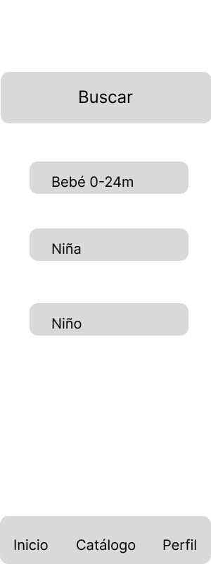
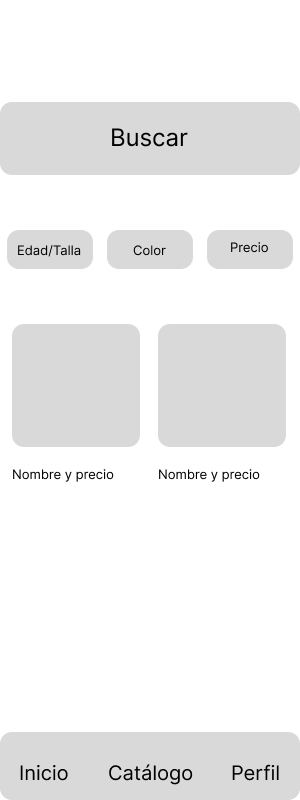
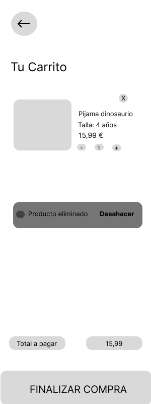
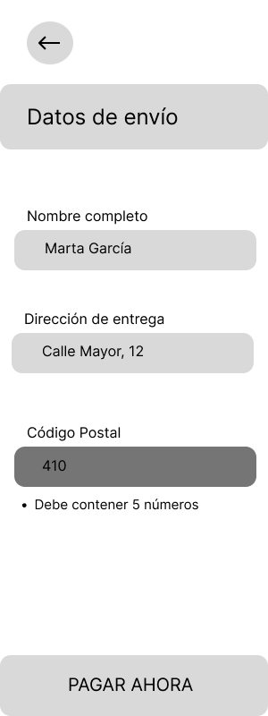
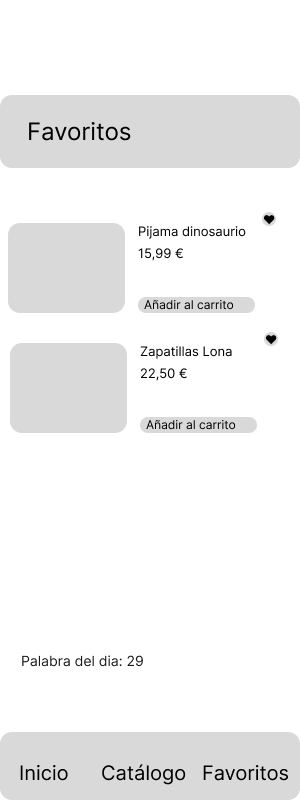

# Documentación de la interfaz — Pequeños Pasos

## 1. Justificación del diseño

### 1.1 Importancia del diseño centrado en el usuario
El diseño centrado en el usuario garantiza que las decisiones tomadas en la interfaz resuelvan problemas reales de los clientes, como la falta de tiempo o la inseguridad al elegir una prenda infantil. Al enfocar la aplicación en padres y familiares que navegan desde el móvil en situaciones de movilidad o distracción, reducimos la fricción en la compra, generamos confianza y mejoramos la tasa de conversión del negocio.

### 1.2 Objetivos y metas del proyecto
1. Reducir el tiempo de selección de talla y el añadido al carrito a menos de 30 segundos por artículo.
2. Conseguir que el 85% de los usuarios complete el proceso de pago (*checkout*) sin cometer errores de validación en el formulario.
3. Asegurar que el 100% de los usuarios tenga acceso visible a la equivalencia en centímetros de cada prenda antes de comprar, para minimizar las devoluciones.

### 1.3 Beneficios esperados
* **Para el usuario:** Una experiencia de compra rápida adaptable al uso con una sola mano, mayor seguridad al elegir la talla correcta gracias a guías accesibles, y un proceso de pago claro y sin distracciones.
* **Para el negocio:** Incremento de las ventas a través del canal móvil, reducción de los costes operativos asociados a las devoluciones por error de talla y mayor fidelización de un cliente recurrente.

## 2. Investigación y análisis de usuarios

### 2.1 Datos demográficos y segmentación
El público objetivo principal abarca a adultos entre 25 y 65 años (madres, padres, abuelos y otros familiares) que compran moda infantil de 0 a 14 años. Se caracterizan por tener un estilo de vida ocupado, realizar compras rápidas desde dispositivos móviles y buscar garantías antes de realizar un pedido para evitar el proceso de devolución.

### 2.2 Personas

#### Persona 1: Marta, la madre en constante movimiento
* **Edad:** 34 años.
* **Contexto:** Trabaja a jornada completa y tiene un hijo de 3 años. Suele hacer las compras online durante sus trayectos en transporte público, a menudo sujetando el móvil con una sola mano.
* **Objetivos:** Comprar ropa de uso diario para la guardería de la forma más rápida posible sin tener que navegar por menús complejos.
* **Frustraciones:** Los botones pequeños que pulsa por error y los formularios de registro largos que le hacen perder tiempo antes de pagar.

#### Persona 2: Antonio, el abuelo que busca acertar
* **Edad:** 68 años.
* **Contexto:** Jubilado, no está tan familiarizado con las compras móviles rápidas. Quiere comprar una chaqueta para el cumpleaños de su nieta de 7 años, pero ella es más alta que la media de su edad.
* **Objetivos:** Comprar un regalo de calidad asegurándose de que la talla le va a quedar bien a su nieta, basándose en la altura y no solo en la edad.
* **Frustraciones:** La letra pequeña en las aplicaciones y la confusión que le genera no encontrar una equivalencia clara de las tallas en centímetros.

### 2.3 Análisis de la competencia

| App Analizada | Qué hacen bien | Qué hacen mal | Qué nos llevamos para Pequeños Pasos |
| :--- | :--- | :--- | :--- |
| **Zara Kids** | Estética muy limpia e imágenes de alta calidad que destacan el producto. | Los filtros y las guías de tallas están ocultos en menús secundarios, lo que dificulta la navegación. | Priorizar la visibilidad de los filtros (*Filter chips*) justo debajo de la barra de búsqueda en el catálogo. |
| **Mayoral** | Ofrecen una tabla de medidas muy completa y específica para ropa infantil. | El proceso de pago (*checkout*) tiene demasiados pasos y recargas de pantalla. | Implementar la guía de tallas, pero integrarla en un *Bottom sheet* rápido, y diseñar un *checkout* unificado. |
| **H&M** | El manejo del carrito es muy claro y permite editar cantidades fácilmente. | Demasiada densidad de información en la ficha del producto, lo que abruma visualmente. | Incorporar el *snackbar* para deshacer acciones en el carrito y mantener la ficha de producto minimalista (M3). |

### 2.4 Insights y hallazgos clave
1. **Insight:** Los familiares (abuelos, tíos) no conocen la correspondencia exacta entre la edad y la talla física del niño. 
   * **Decisión de diseño:** Incluir un botón de "Guía de tallas" muy visible en el detalle del producto que abra un *Bottom sheet* (panel inferior) sin sacar al usuario de la pantalla de compra.
2. **Insight:** Las madres y padres compran en situaciones de movilidad, usando el pulgar y con una sola mano.
   * **Decisión de diseño:** Diseñar áreas táctiles grandes (mínimo 48x48 dp) y ubicar las acciones principales (como la *Navigation bar* y el botón de pago) en la parte inferior de la pantalla.
3. **Insight:** Los usuarios abandonan la búsqueda si no pueden filtrar rápidamente por la edad o el precio que necesitan.
   * **Decisión de diseño:** Integrar *Filter chips* horizontales y deslizables en la pantalla del catálogo para aplicar filtros con un solo toque.

## 3. Arquitectura de la información y wireframes

### 3.1 Mapa de navegación

```mermaid
graph TD
    A[Inicio] --> B[Catálogo]
    A --> C[Favoritos]
    B --> D[Detalle de Producto]
    C --> D
    D --> E[Carrito]
    E --> F[Checkout]
    F --> G((Confirmación))
    G --> A
    
 ```
### 3.2 Wireframes de baja fidelidad








